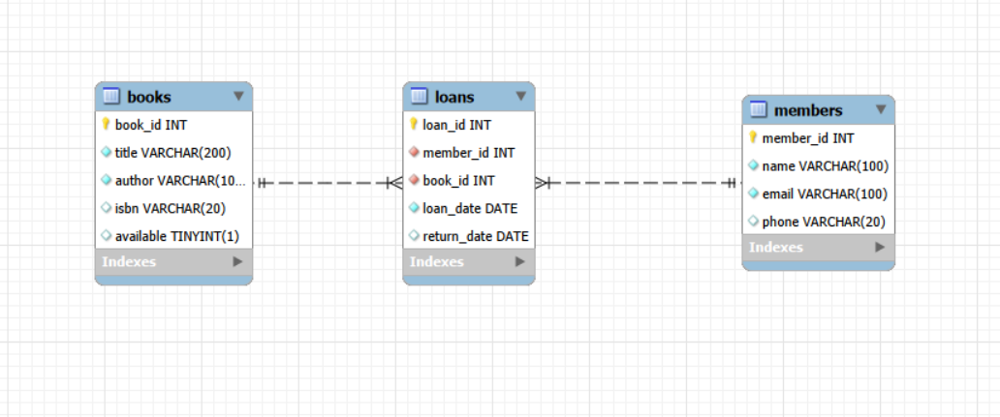

# 📚 LibraSys — Console Library Management System

A console-based Library Management System built with **Java** and **SQL (MySQL)** to practice core backend and database concepts: JDBC connectivity, CRUD operations, relational schema design, and layered application architecture (Model–DAO–Service–Main).

No GUI — pure command-line interaction with a persistent SQL database.

---

## Features

- **Book Management** — add and search books by title or author; availability tracked per book
- **Member Management** — register members and view their full borrowing history
- **Borrow / Return System** — issue and return books, with automatic availability updates and cross-table consistency between `Loans` and `Books`
- **Due Dates & Fines** — due dates and overdue fines are calculated in Java (14-day loan period, $0.50/day late fee) on top of the raw dates stored in the database
- **Input Validation** — blank fields, invalid email formats, unavailable books, and nonexistent IDs are all caught before touching the database
- **Persistent Storage** — all data stored in a relational MySQL database via JDBC, using `PreparedStatement`s throughout (no SQL injection risk)

---

## Tech Stack

- **Language:** Java (JDK 21+), built with **Maven**
- **Database:** MySQL
- **Connectivity:** JDBC (via `mariadb-java-client`, which is wire-protocol compatible with MySQL)
- **Interface:** Command-line (`System.in` / `Scanner`)

---

## Architecture

```
src/main/java/
├── model/     → Book, Member, Loan classes (POJOs — no SQL, no business logic)
├── dao/       → Database access layer (JDBC queries only, one table each)
├── service/   → Business logic layer (validation, borrowing rules, fine calculation)
└── Main.java  → Console menu — reads input, calls one Service method, prints the result

src/main/resources/
└── db.properties   → Local DB credentials (gitignored — see Setup below)
```

**The rule that shapes this whole project:** each layer only talks to the one directly below it.
`Main` never touches SQL. `BookService`/`MemberService` never know the other exists, or that `Loans` exists at all. `LoanService` is the one class allowed to coordinate across all three entities, because that coordination — "issuing a book is one write to `Loans` *and* one write to `Books`, treated as a single action" — is exactly what a service layer is for.

---

## Database Schema

```sql
CREATE TABLE Members (
    member_id INT AUTO_INCREMENT PRIMARY KEY,
    name VARCHAR(100) NOT NULL,
    email VARCHAR(100) UNIQUE NOT NULL,
    phone VARCHAR(20)
);

CREATE TABLE Books (
    book_id INT AUTO_INCREMENT PRIMARY KEY,
    title VARCHAR(200) NOT NULL,
    author VARCHAR(100) NOT NULL,
    isbn VARCHAR(20) UNIQUE,
    available BOOLEAN DEFAULT TRUE
);

CREATE TABLE Loans (
    loan_id INT AUTO_INCREMENT PRIMARY KEY,
    member_id INT NOT NULL,
    book_id INT NOT NULL,
    loan_date DATE NOT NULL,
    return_date DATE,
    FOREIGN KEY (member_id) REFERENCES Members(member_id),
    FOREIGN KEY (book_id) REFERENCES Books(book_id)
);
```

**Design notes:**
- `Books.available` is a single boolean, not a copy count — this system models one physical copy per book.
- `Loans` stores only `loan_date` and `return_date`. There is **no `due_date` or fine column** — both are calculated on demand in `LoanService` (`due date = loan_date + 14 days`), keeping the schema minimal and the business rules in code, not the database.
- `return_date IS NULL` is how an "active" (currently out) loan is identified.

### Entity-Relationship Diagram



*(Screenshot exported from MySQL Workbench's "Reverse Engineer" / relationship view. To add yours: save the image as `er-diagram.png` inside a `docs/` folder at the project root, and it will render automatically on GitHub via the line above.)*

---

## Setup

### 1. Clone the repo
```powershell
git clone https://github.com/yourusername/librasys.git
cd librasys
```

### 2. Create the database
```powershell
mysql -u root -p < database/schema.sql
```

### 3. Configure your database credentials
Credentials are **not hardcoded** — they're loaded at runtime from `src\main\resources\db.properties`, which is excluded from version control via `.gitignore` so real passwords never get pushed to GitHub.

```powershell
copy src\main\resources\db.properties.example src\main\resources\db.properties
```
Then open `db.properties` and fill in your real password:
```properties
db.url=jdbc:mysql://localhost:3306/librasys
db.user=root
db.password=your_real_password_here
```

### 4. Get the MySQL JDBC driver
Download the **Platform Independent / ZIP Archive** build from [dev.mysql.com/downloads/connector/j](https://dev.mysql.com/downloads/connector/j/), extract it, and copy the `.jar` file into a `lib\` folder in the project root, renamed to `mysql-connector-j.jar`.

---

## Build & Run

**Compile:**
```powershell
& "C:\Program Files\Java\jdk-24\bin\javac.exe" -d bin src\main\java\model\*.java src\main\java\dao\*.java src\main\java\service\*.java src\main\java\Main.java
```

**Run:**
```powershell
& "C:\Program Files\Java\jdk-24\bin\java.exe" -cp "bin;src\main\resources;lib\mysql-connector-j.jar" Main
```

> The classpath needs **three** entries: `bin` (compiled classes), `src\main\resources` (where `db.properties` actually lives — `javac` doesn't copy resource files), and the JDBC driver jar.

---

## Testing

`tests/test_input.txt` is a scripted input file that drives the console app through every menu option automatically, using PowerShell's `Get-Content` to simulate a full user session:

```powershell
Get-Content tests\test_input.txt | & "C:\Program Files\Java\jdk-24\bin\java.exe" -cp "bin;src\main\resources;lib\mysql-connector-j.jar" Main *>&1 | Tee-Object -FilePath tests\test_output.log
```

This both prints the run live to the console **and** saves a full transcript to `tests\test_output.log`, so behavior can be diffed against previous runs after any code change.

### What it covers

| # | Scenario | Verifies |
|---|---|---|
| 1 | Add two valid books (with and without an ISBN) | Basic insert; `isbn` is nullable |
| 2 | Add a book with a **blank title** | `BookService` validation rejects it before it ever reaches the DAO |
| 3 | View all books | Only the 2 valid books exist — confirms the blank-title book was never inserted |
| 4 | Search `"dune"` | Case-insensitive partial match via SQL `LIKE` |
| 5 | Search with a **blank keyword** | Rejected with a message, no crash, no wasted DB call |
| 6 | Register a member, then register a **second member with the same email** | MySQL's `UNIQUE` constraint on `email` is caught and reported as a friendly message rather than crashing |
| 7 | Register a member with an **invalid email format** (`notanemail`) | `MemberService`'s basic format check (`contains("@")`) catches it |
| 8 | Issue a book to a member | Successful loan creation; `Books.available` flips to `false` |
| 9 | Issue the **same book again** | Correctly blocked — book is already out |
| 10 | Issue a **nonexistent book ID (99)** | Rejected cleanly, no exception |
| 11 | Issue to a **nonexistent member ID (99)** | Rejected cleanly, no exception |
| 12 | View active loans | Shows the one open loan with its computed due date |
| 13 | View all books | Confirms the borrowed book now shows `Borrowed` |
| 14 | Return the book | Success, on-time, no fine |
| 15 | **Return the same book again** | Correctly rejected — book is not currently on loan |
| 16 | View active loans | Now empty, confirming the loan closed correctly |
| 17 | View member borrowing history | Shows the completed loan with its return date |
| 18 | View history for a **nonexistent member ID** | Rejected cleanly |

### The corner cases worth calling out specifically

- **Duplicate email (#6)** is deliberately *not* checked with a "does this email already exist?" query before inserting. Checking-then-inserting is a race condition — two near-simultaneous registrations could both pass the check before either finishes inserting. Instead, the database's own `UNIQUE` constraint is the single source of truth, and a failed insert is *interpreted* as a likely duplicate afterward.
- **Double-issuing a book (#9)** and **double-returning a book (#15)** both test that `LoanService` correctly reads current state (`available` flag / `return_date IS NULL`) before acting, rather than blindly trusting user input.
- **Blank-input tests (#2, #5)** confirm validation happens in the **Service layer**, before any SQL is executed — a wasted round-trip to the database for input that was already known to be invalid would be a design smell.
- **Overdue/fine calculation** isn't exercised by this script, since it always uses today's date. To test it, manually backdate a loan after issuing it:
  ```sql
  UPDATE Loans SET loan_date = DATE_SUB(CURDATE(), INTERVAL 20 DAY) WHERE loan_id = <id>;
  ```
  Then re-run the app and check option `6` (View Active Loans) for the `OVERDUE` flag, and option `5` (Return Book) for the calculated fine.

---

## Example Console Menu

```
=== LibraSys ===
1. Add Book
2. Search Book
3. Register Member
4. Issue Book
5. Return Book
6. View Active Loans / Overdue
7. View All Books
8. View Member Borrowing History
0. Exit
Choose an option:
```

---

## What This Project Demonstrates

- Writing raw SQL and executing it from Java via JDBC (`PreparedStatement`s, `ResultSet`s, generated keys)
- Designing a normalized relational schema with foreign keys and `UNIQUE` constraints, and handling their failure modes gracefully in application code
- A layered architecture (Model → DAO → Service → Main) with a single, deliberate point of cross-entity coordination
- Keeping secrets out of version control via an externalized `db.properties` file
- Scripted, repeatable console testing with logged output for regression checking
- Honest handling of the project's current limitations (e.g., no multi-statement transactions yet on the two-table issue/return writes) as concrete "future improvements" rather than hidden gaps

---

## License
MIT License